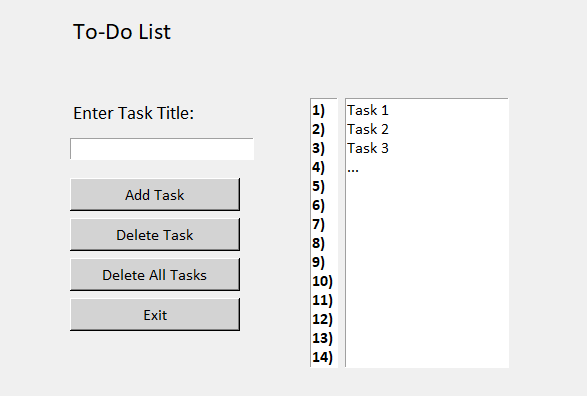

# To-Do List Application

**MAKE SURE TO HAVE BOTH TODO.TXT AND TODOLIST.PY DOWNLOADED & IN THE SAME FOLDER**

A python application that keeps track of tasks, which are saved locally on the computer. It has a simplistic and minimalistic UI which is locked to 600 x 400, to not interfere with the rest of the user's running programs.

## How It's Made:

**Tech used:** Python, Tkinter

The first thing I did was I imported Tkinter and set up the UI, adding buttons, textboxes, and outputs where neccessary using a "Window" class. Within this class, I also defined some attributes of the window, and I defined some methods which contained the code that gave the buttons functionality. 

One of these methods created a message box whenever the program was shut using the x button, to prompt the user to confirm (and subsequently save their tasks). Within the method to add a task, I ensured there were no duplicates, and also removed any leading or trailing white space, to ensure cleaner inputs. I left the input case sensitive however, as I felt this would impede on the user experience, if I forced it lower case. The deleteTask method uses logic to ensure when the task to delete is chosen, the input is valid, and any exceptions are handled. The final methods of significance, are the save and load task methods, which are called automatically whenever the program is opened, or closed. This method either saves or loads the current task from [Todo.txt](Todo.txt). Overall, this program is simple, yet it is sleek and useful. 

However there are potential future improvements to be made. Most notably, the delete task method is potentially clunky, with the user being prompted to enter a numerical value corresponding to the position of a task. To solve this, the output text box, should be changed to a list box, which is clickable (and the delete method would delete the selected task).

## Optimizations

Most of the optimisations that I implemented were to smoothen the user experience. For example, automatically saving and loading tasks to/from a txt file, as opposed to having to manually save. Furthermore, I added line numbers to the tasks, so the user can easily identify which position the task is located in. Finally, I made the buttons grey in order to differentiate the buttons, but also to keep the UI sleek and minimalistic. Another example of this is the ability to use the enter key instead of the add task button, making the user experience that slight bit more seamless.

## Lessons Learned:

Since this is my first real project, I wanted to not only learn how to create a UI, but also create a practical program with a real world use in my life. I happen to use to do lists very frequently, which inspired me to code one myself. This was a huge learning experience, where not only did I become more comfortable with OOP, but I learned the basics of Tkinter. This project has developed my coding skills with Python, and has also helped to create a new passion and hobby. I hope I can use this newfound knowledge and passion to create bigger and better projects in the future.

## License

This project is licensed under the MIT License - see the [LICENSE.md](LICENSE.md) file for details
